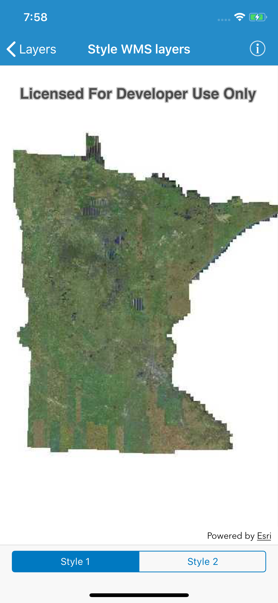

# Style WMS layers

This sample demonstrates how to discover available styles and apply them to WMS sublayers.

## How to use the sample

Use the buttons to switch between styles.

## How it works

This sample examines the WMS layer's sublayers and checks the sublayer info for a list of available styles. The `currentStyle` is then set on the WMS sublayer.

## Relevant API

* `AGSWMSLayerInfo`
* `AGSWMSLayer.sublayers`
* `AGSWMSLayerInfo.styles`
* `AGSWMSSublayer.currentStyle`

## About the data

This sample uses a public service managed by the State of Minnesota and provides composite imagery for the state and the surrounding areas.

## Tags

WMS, styles, imagery
