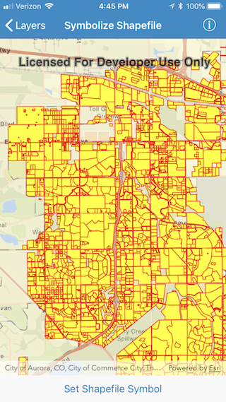

# Symbolize Shapefile

This sample demonstrates how to override the default renderer of a shapefile when displaying with a FeatureLayer.

## How it works

The sample creates an `AGSShapefileFeatureTable` using the initializer `init(name:)` where the name refers to a shapefile that has been included in the application bundle. The shapefile feature table is used to instantiate an `AGSFeatureLayer` which is added to the operational layers of a map. The map view is then zoomed to the shapefile's full extent.

To override the default symbology of the feature layer, a `AGSSimpleRenderer` is created using a yellow `AGSSimpleFillSymbol` with a 1pt red outline.
 