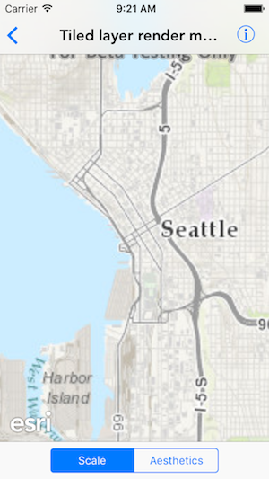
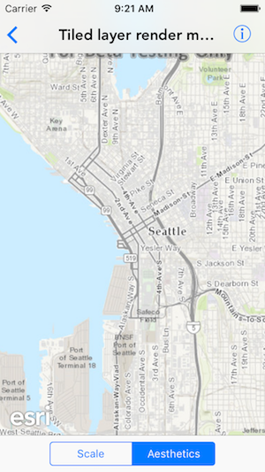

#Tiled layer render mode (URL)

This sample demonstrates how to change the render mode for a tiled layer. You can choose between the SCALE and the AESTHETIC mode. 

##How it works

The sample switches between the two rendering mode by setting the `renderMode` property on `AGSArcGISTiledLayer`.

