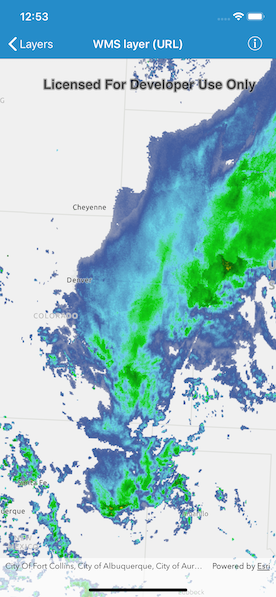

# WMS layer (URL)

This sample demonstrates how to open a WMS layer from a URL and display it in a map.

## How it works

`AGSWMSLayer` provides an initializer called `init(url:layerNames:)` that takes a WMS service URL and an array of layer names available in the WMS service. The URL must be the URL to the `GetCapabilities` endpoint of the WMS Service. The sample loads the WMS Layer using `load(completion:)` method. And on successful completion, the layer is added to the collection of map's operational layers.
