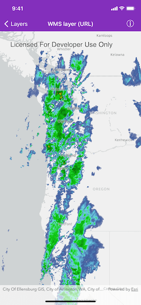

# WMS layer (URL)

Display a WMS layer using a WMS service URL.

## Use case

WMS is an OGC standard for displaying maps from images that are dynamically-generated on a web server. WMS is particularly useful for data that changes frequently, contains cartographically complex detail, or requires an open source data standard.

## How to use the sample

The map will load automatically when the sample starts. Pan and zoom to explore.

## How it works

1. Create an `AGSWMSLayer` specifying the URL of the service and the names of layers you want to display.
    **Note**: The name comes from the `Name` property, not the `Title` property. On many services, the title is human-readable while the name is a numeric identifier.
2. After the `AGSWMSLayer` loads, add it to the map's `operationalLayers` array.

## About the data

This sample uses a [U.S. National Weather Service radar map](https://nowcoast.noaa.gov/arcgis/services/nowcoast/radar_meteo_imagery_nexrad_time/MapServer/WMSServer?request=GetCapabilities&service=WMS). Because WMS services generate map images on-the-fly, this layer is always up-to-date with the latest [NOAA NEXRAD radar](https://www.ncdc.noaa.gov/data-access/radar-data/nexrad) observations.

## Relevant API

* AGSMap
* AGSMapView
* AGSWMSLayer

## Tags

OGC, web map service, WmsLayer
