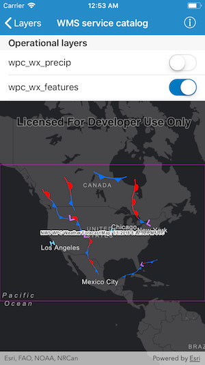

# WMS service catalog

This sample demonstrates how to programmatically discover layers from a WMS service and display them on map.

## How to use the sample

The sample starts with a map that contains a Dark Gray Canvas basemap. It also presents a list of top-most layers that are available in the WMS service. Each layer in the list has a switch, which can be used to add the layer to map or remove the layer from map.

## How it works

`AGSWMSService` is initialized using the `init(url:)` method that takes a URL to the WMS service. It then loads the WMS service using the `load(completion:)` method and obtains the `AGSWMSServiceInfo` from the loaded WMS service and an array of `AGSWMSLayerInfo` from the `AGSWMSServiceInfo`.  

`AGSWMSLayer` provides an initializer called `init(layerInfos:)` method that takes an array of `AGSWMSLayerInfo`. This sample creates WMS layers from the layer infos of the top-most layers in the WMS service.

`AGSMap` has a property called `operationalLayers` which is a list of `AGSLayer`. The WMS layer is added to map's operational layers using the `add()` method and removed from map's operational layers using the `remove()` method.
