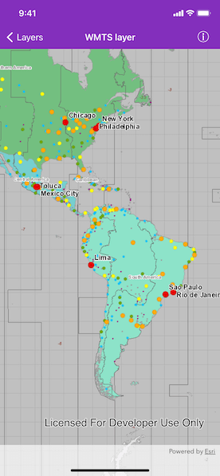

# WMTS layer

Display a layer from a Web Map Tile Service.

## Use case

WMTS services can have several layers. You can use Runtime to explore the layers available from a service. This would commonly be used to enable a browsing experience where users can choose which layers they want to display at run time.

## How to use the sample

The layer will be displayed automatically. Pan and zoom to explore.

## How it works

To display a WMTS layer directly from a URL:

1. Create an `AGSWMTSService` object using the URL of the WMTS service.
2. Create an `AGSWMTSLayer` object with the ID of the layer to display.
3. Make an `AGSBasemap` from the `AGSWMTSLayer` and apply it to the map.

## Relevant API

* AGSWMTSLayer
* AGSWMTSLayerInfo
* AGSWMTSService
* AGSWMTSServiceInfo

## About the data

The map visualizes world time zones.

## Tags

layer, OGC, raster, tiled, web map tile service
