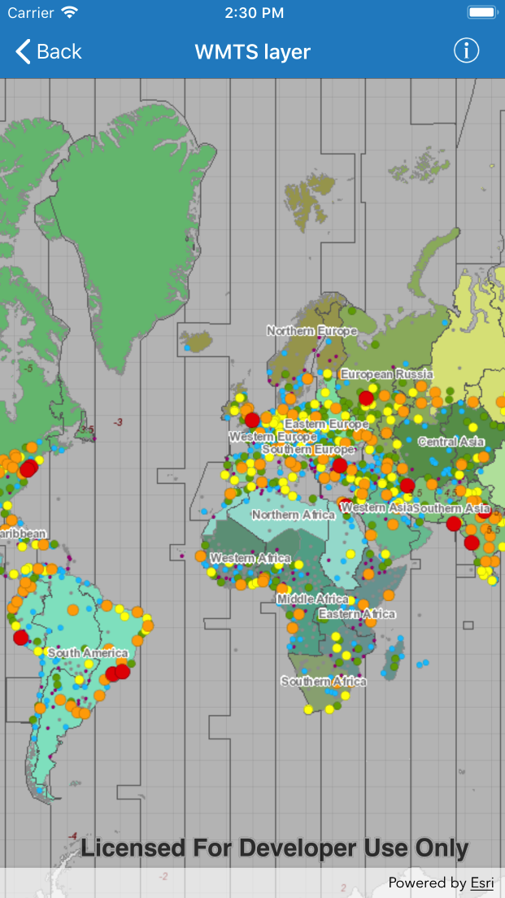

# WMTS layer

This sample demonstrates how to display a WMTS layer as a basemap layer.

## How it works

The samples uses `init(url:)` initializer on `AGSWMTSService` to instantiate WMTS service using the service URL. It then loads the WMTS service using `load(completion:)` method. Once the service loads, obtain the `AGSWMTSServiceInfo` and an array of `AGSWMTSLayerInfo` from the loaded `AGSWMTSService`. This particular sample gets the first element from the array of `AGSWMTSLayerInfo` and instantiates `AGSWMTSLayer` using `init(layerInfo:)` initializer. Finally, the `AGSWMTSLayer` is added to the map as a basemap layer.
