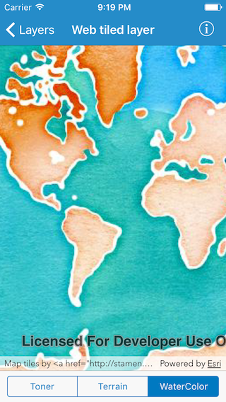

# Web tiled layer

This sample demonstrates how to display map tiles from an online resource

## How it works

`AGSWebTiledLayer` provides a simple way to integrate non-ArcGIS Services as a layer in a map. In this case, map tiles from Stamen are added to the map. The template URL is specified by setting the subDomains, level, col, and row attributes. Additionally, copyright information is added to the layer so that the layer can be properly attributed. The layer is added to an `AGSBasemap`, and the basemap is added to an `AGSMap`. Finally, the map is set on the `AGSMapView`, and the tiled layer is displayed.

