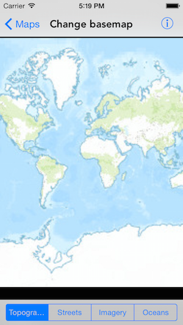

#Change basemap

This sample demonstrates how to change basemap of a map.

##How to use the sample

The sample provides a switch in the bottom toolbar, you can use to change the basemap of the map

##How it works

`AGSMap` has a `basemap` property of type `AGSBasemap`. On each selection, the app creates a new basemap of the specified type and assigns it to `map.basemap`. `AGSBasemap` provides a set of factory methods for each of Esri's basemap.

