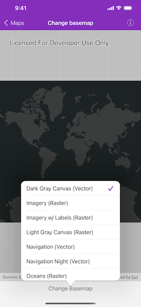

# Change basemap

Change a map's basemap. A basemap is beneath all layers on an `AGSMap` and is used to provide visual reference for the operational layers.

## Use case

Basemaps should be selected contextually. For example, in maritime applications, it would be more appropriate to use a basemap of the world's oceans as opposed to a basemap of the world's streets.

## How to use the sample

Tap the "Change Basemap" button in the bottom toolbar to view a list of the available basemaps. Tap an item to set it as the map's basemap.

## How it works

1. Create an `AGSMap` object.
2. Set the map to the `AGSMapView` object.
3. Choose a new basemap type and set it on the map.

## Relevant API

* AGSBasemap
* AGSMap
* AGSMapView

## Tags

basemap, map
