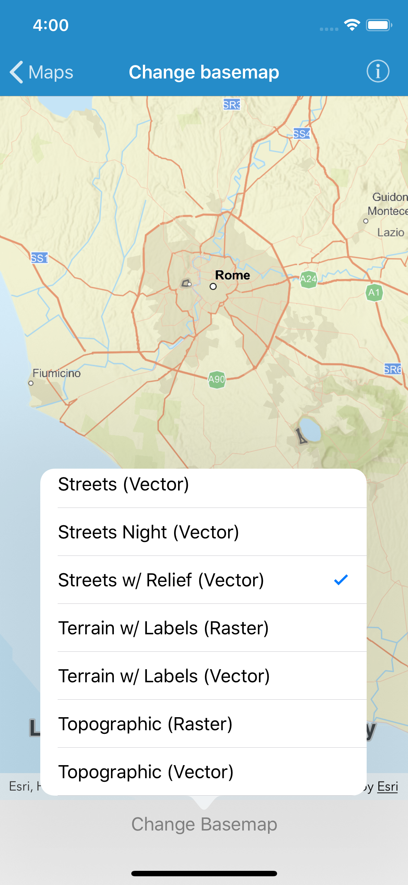

# Change basemap

This sample demonstrates how to change the basemap of a map.

## How to use the sample

Tap the "Choose Basemap" button in the bottom toolbar to view a list of the available basemaps. Tap an item to set it as the map's basemap.

## How it works

`AGSMap` has a `basemap` property of type `AGSBasemap`. Upon selecting an item in the table, the corresponding `AGSBasemap` object is set as the map's `basemap`. `AGSBasemap` provides a set of factory methods for each of Esri's basemap.