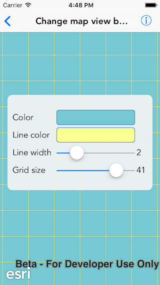

#Change map view background

This sample demonstrates how to customize map view’s background grid

##How to use the sample

The sample provides a settings view which is always visible. You can tap on the color  next to `Color` and `Line color` to change. You can use the sliders to change the grid line width and grid size.

##How it works

`AGSMapView` has a property called `AGSBackgroundGrid`. The background grid lets you customize the background of the map view with the following properties:
- `color` : fill color
- `gridLineColor` : color of background grid lines
- `gridLineWidth` : width (in points) of background grid lines
- `gridSize` : size (in points) of the background grid

