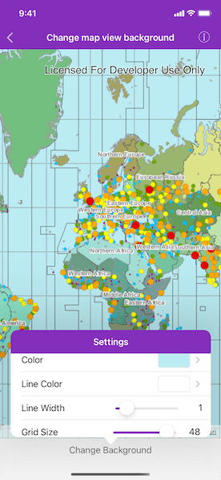

# Change map view background

Customize map view's background by changing its grid properties.

## Use case

Basemaps should be selected contextually. For example, in maritime applications, it would be more appropriate to use a basemap of the world's oceans as opposed to a basemap of the world's streets.

## How to use the sample

Tap the "Change background" button in the toolbar to open the settings view. Tap the color next to "Color" and "Line color" rows to change the background color and the grid's line color respectively. Use the sliders to change the grid line width and grid size.

## How it works

1. Create an `AGSMap` object.
2. Set the map to the `AGSMapView` object.
3. Set the background grid style in the settings and set it to the map view's `backgroundGrid` property. Customize the background grid with the following properties:
    * `color`: fill color
    * `gridLineColor`: color of background grid lines
    * `gridLineWidth`: width (in points) of background grid lines
    * `gridSize`: size (in points) of the background grid

## Relevant API

* AGSBackgroundGrid
* AGSMap
* AGSMapView

## Tags

background, grid, map
