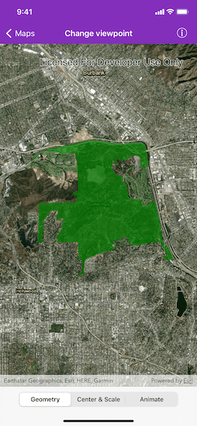
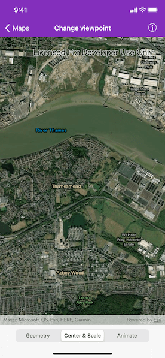

# Change viewpoint

Set the map view to a new viewpoint.

## Use case

Programatically navigate to a specified location in the map or scene. Use this to focus on a particular point or area of interest.

## How to use the sample

The map view has several methods for setting its current viewpoint. Select a viewpoint from the UI to see the viewpoint changed using that method.

## How it works

1. Create an `AGSMap` object and set it to the `AGSMapView` object.
2. Change the map's viewpoint using one of the available methods:
    * Use `AGSMapView.setViewpoint(_:duration:curve:completion:)` to pan to a viewpoint over the specified length of time.
    * Use `AGSMapView.setViewpointCenter(_:scale:completion:)` to center the viewpoint on an `AGSPoint` and set a distance from the ground using a scale.
    * Use `AGSMapView.setViewpointGeometry(_:padding:completion:)` to set the viewpoint to a given `AGSGeometry`.

## Relevant API

* AGSGeometry
* AGSMap
* AGSMapView
* AGSPoint
* AGSViewpoint

## Additional information

See the various setViewpoint methods on `AGSGeoView` and `AGSMapViewCommon`.

* AGSGeoView.setViewpoint(_:)
* AGSGeoView.setViewpoint(_:completion:)
* AGSGeoView.setViewpoint(_:duration:completion:)
* AGSMapViewCommon.setViewpoint(_:duration:curve:completion:)
* AGSMapViewCommon.setViewpointCenter(_:completion:)
* AGSMapViewCommon.setViewpointCenter(_:scale:completion:)
* AGSMapViewCommon.setViewpointGeometry(_:completion:)
* AGSMapViewCommon.setViewpointGeometry(_:padding:completion:)
* AGSMapViewCommon.setViewpointRotation(_:completion:)
* AGSMapViewCommon.setViewpointScale(_:completion:)

## Tags

animate, extent, pan, rotate, scale, view, zoom
