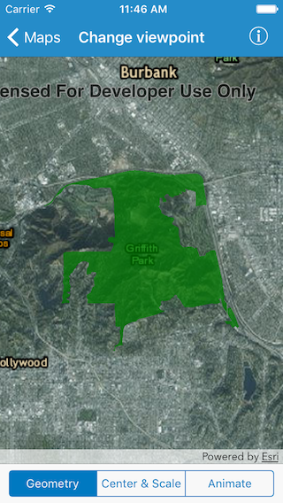
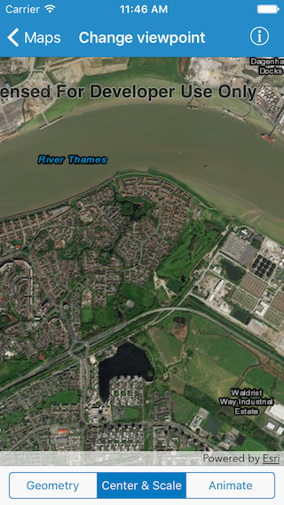

#Change viewpoint

This sample demonstrates different ways in which you can change the viewpoint or visible area of a map.

##How it works

`AGSMapView` provides different methods you can use to set the viewpoint. The app uses the `setViewpointGeometry:padding:completion:` method to zoom to the Griffith Park geometry, `setViewpointCenter:scale:completion:` method to zoom to London and `setViewpoint:duration:curve:completion:` method for animation. Apart from these, there are some other methods (mentioned below) you can use.

* setViewpoint:
* setViewpoint:completion:
* setViewpoint:duration:completion:
* setViewpointCenter:completion:
* setViewpointGeometry:completion:
* setViewpointRotation:completion:
* setViewpointScale:completion:

