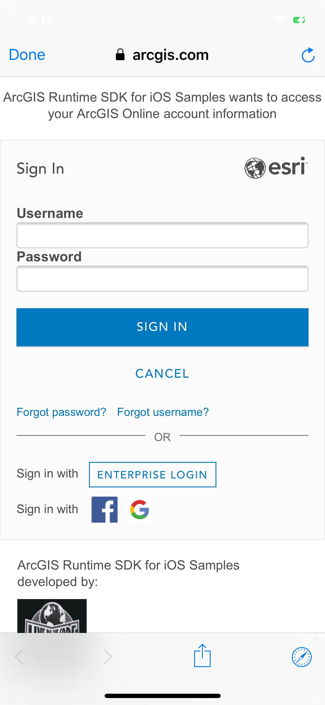

#Create and save a map

This sample demonstrates how to create a map and save it to your portal

##How to use the sample

On opening the sample you get to choose the layers for your map. You can choose a basemap and optionally one or more operational layers. Tapping on `Done` button should display a map with those layers added. You can tap on the `New` button to start over or the `Save` button to save the map to your portal. You will be required to login and provide a title, tags and description for the map.

##How it works

The sample uses a pre-populated list of layers and basemaps. When you tap on `Done`, the selected basemap is used to create an `AGSMap` object using `init(basemap:)` initializer. The authentication is handled by `AGSAuthenticationManager`. And to save the map the sample uses `save(as:portal:tags:folder:itemDescription:thumbnail:forceSaveToSupportedVersion:completion:)` method on `AGSMap`.

