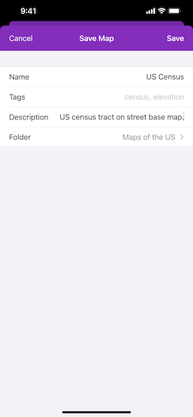

# Create and save a map

Create and save a map as a portal item (i.e. web map).

## Use case

Maps can be created programmatically in code and then serialized and saved as an ArcGIS web map. A web map can be shared with others and opened in various applications and APIs throughout the platform, such as ArcGIS Pro, ArcGIS Online, the JavaScript API, Collector, and Explorer.

## How to use the sample

Select the basemap and layers you'd like to add to your map. Tap the "Save" button. Sign into an ArcGIS Online account. Provide a title, tags, and description. Save the map.

## How it works

1. An `AGSMap` is created with an `AGSBasemap` and a few operational layers.
2. An `AGSPortal` object is created and loaded. This will issue an authentication challenge, prompting the user to provide credentials.
3. Once the user is authenticated, call `AGSMap.save(as:portal:tags:folder:itemDescription:thumbnail:forceSaveToSupportedVersion:completion:)` and a new map is saved with the specified title, tags, and folder.

## Relevant API

* AGSMap
* AGSMap.save
* AGSPortal

## Additional information

In this sample, an API key is set directly on `AGSBasemap` objects rather than on the whole app using the `AGSArcGISRuntimeEnvironment` class. This is useful in a scenario where an individual developer is part of an organization within ArcGIS Online that uses an API key to access a range of `AGSBasemapStyle`s. In the case that an individual member of the organization wants to save a map locally to their account, and not that of the organization, they can set the organization's API key on the basemap, and log in to their own account when challenged.  The individual can then save the final map to their own ArcGIS Online account.

## Tags

ArcGIS Online, ArcGIS Pro, portal, publish, share, web map
