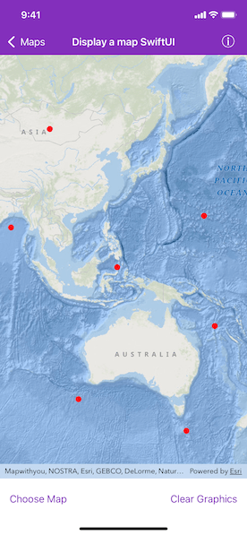

# Display a map SwiftUI

Display a map and demonstrate common usecases in SwiftUI.

## Use case

The map is the fundamental building block of any GIS application and is used to specify how geographic data is organized and communicated to your users. With the introduction of SwiftUI in iOS 13, it's worth exploring the interoperability of SwiftUI and current Runtime SDK, while waiting for the new Runtime SDK in Swift.

## How to use the sample

Run the sample to view the map. Single tap on the map to add a circle marker to the map. Tap "Change Basemap" button to change the basemap. Tap "Clear Graphics" button to clear all added graphics.

## How it works

1. Create a `SwiftUIMapView` to wrap an `AGSMapView` with SwiftUI `UIViewRepresentable` protocol.
2. Create a nested `Coordinator` type to implement `AGSGeoViewTouchDelegate` methods.
3. Create a `MapViewContext` type to hold other properties for the map view.
4. Create a `DisplayMapSwiftUIView` to combine the `SwiftUIMapView` together with other view components, automatically preview in Xcode, and provide useful context for the map.
5. Create a `UIHostingController` to integrate and manage the `DisplayMapSwiftUIView` into UIKit view hierarchy.

## Relevant API

* AGSBasemapStyle
* AGSMap
* AGSMapView

## Additional information

This sample demonstrates how to use `AGSMapView` in SwiftUI. It features...

* Using SwiftUI together with storyboard via [`UIHostingController`](https://developer.apple.com/documentation/swiftui/uihostingcontroller)
* Embedding a `UIView` in a SwiftUI view via [`UIViewRepresentable`](https://developer.apple.com/documentation/swiftui/uiviewrepresentable) protocol
* Using [`Coordinator`](https://developer.apple.com/documentation/swiftui/uiviewrepresentable/coordinator) pattern to translate Cocoa delegate methods into SwiftUI view actions
* Common usecases of a map: adding graphics to a map view; changing basemap; responding to tap events on a map view

## Tags

basemap style, interface, interoperability, map, SwiftUI
