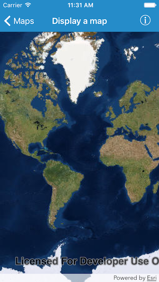

#Display a map

This samples demonstrates how to display a map with a basemap

##How it works

`AGSMap` provides an initializer `init(basemap:)` to instantiate a map to use the given basemap. Then you just need to assign that map to the `AGSMapView` object.

