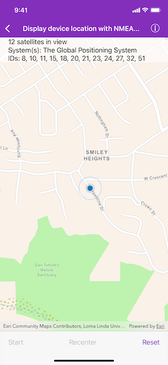

# Display device location with NMEA data sources

Parse NMEA sentences and use the results to show device location on the map.

## Use case

NMEA sentences can be retrieved from an MFi GNSS/GPS accessory and parsed into a series of coordinates with additional information.

The NMEA location data source allows for detailed interrogation of the information coming from a GNSS accessory. For example, allowing you to report the number of satellites in view, accuracy of the location, etc.

## How to use the sample

Tap "Source" to choose between a simulated location data source or any data source created from a connected GNSS device, and initiate the location display. Tap "Recenter" to recenter the location display. Tap "Reset" to reset the location display and location data source.

## How it works

1. Load NMEA sentences.
    * If a supported GNSS accessory is connected, the sample can get NMEA updates from it.
    * Otherwise, the sample will read mock data from a local file.
2. Create an `AGSNMEALocationDataSource`. There are 2 ways to provide updates to the data source.
    * When updates are received from a GNSS accessory or the mock data provider, push the data into `AGSNMEALocationDataSource`.
    * Starting with Runtime SDK 100.11, you can initialize `AGSNMEALocationDataSource` with a GNSS accessory. The data source created this way will automatically get updates from the accessory instead of requiring to push data explicitly.
3. Set the `AGSNMEALocationDataSource` to the location display's data source.
4. Start the location display to begin receiving location and satellite updates.

## Relevant API

* AGSLocation
* AGSLocationDisplay
* AGSNMEALocationDataSource
* AGSNMEASatelliteInfo

## About the data

A list of NMEA sentences is used to initialize a `SimulatedNMEADataSource` object. This simulated data source provides NMEA data periodically and allows the sample to be used without a GNSS accessory.

The route taken in this sample features a [2-minute driving trip around Redlands, CA](https://arcgis.com/home/item.html?id=d5bad9f4fee9483791e405880fb466da).

## Additional information

To support GNSS accessory connection in an app, here are a few steps:

* Enable Bluetooth connection in the device settings or connect via cable connection.
* Refer to the device manufacturer's documentation to get its protocol string and add the protocol to the app’s `Info.plist` under the `UISupportedExternalAccessoryProtocols` key.
* When working with any MFi accessory, the end user must register their iOS app with the accessory manufacturer first to whitelist their app before submitting it to the App Store for approval. This is a requirement by Apple and stated in the iOS Developer Program License Agreement.

Please read Apple's documentation below for further details.

* [`EAAccessory`](https://developer.apple.com/documentation/externalaccessory)
* [`UISupportedExternalAccessoryProtocols`](https://developer.apple.com/documentation/bundleresources/information_property_list/uisupportedexternalaccessoryprotocols)

Below is a list of protocol strings for commonly used GNSS external accessories. Please refer to the [ArcGIS Field Maps documentation](https://doc.arcgis.com/en/field-maps/ios/help/high-accuracy-data-collection.htm#ESRI_SECTION2_612D328A655644DCAF5CF0210308C821) for model and firmware requirements.

**Supported by this sample**

* com.bad-elf.gps
* com.eos-gnss.positioningsource
* com.geneq.sxbluegpssource

**Others**

* com.amanenterprises.nmeasource
* com.dualav.xgps150
* com.garmin.pvt
* com.junipersys.geode
* com.leica-geosystems.zeno.gnss
* com.searanllc.serial
* com.trimble.correction, com.trimble.command (1)

(1) Some Trimble models requires a proprietary SDK for NMEA output.

## Tags

accessory, Bluetooth, GNSS, GPS, history, navigation, NMEA, real-time, trace
