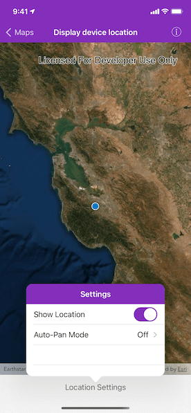
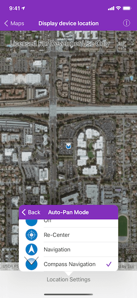

# Display device location

Display your current position on the map, as well as switch between different types of auto pan modes.

## Use case

When using a map within a GIS application, it may be helpful for a user to know their own location within a map, whether that's to aid the user's navigation or to provide an easy means of identifying/collecting geospatial information at their location.

## How to use the sample

Tap the "Location Settings" button to open the settings interface.

Toggle "Show Location" to change the visibility of the location indicator in the map view. It will be asked by the system to provide permission to use the device's location, if the user have not yet used location services in this app.

Change the "Auto-Pan Mode" to choose if and how the SDK will position the map view's viewpoint to keep the location indicator in-frame. A menu will appear with the following options to change the `AGSLocationDisplayAutoPanMode`:

* Off - Starts the location display with no auto-pan mode set.
* Re-Center - Starts the location display with auto-pan mode set to `.recenter`.
* Navigation - Starts the location display with auto-pan mode set to `.navigation`.
* Compass Navigation - Starts the location display with auto-pan mode set to `.compassNavigation`.

## How it works

1. Create an `AGSMapView`.
2. Update the `AGSLocationDisplay` property of the map view.
3. Use the `autoPanMode` property to change the how the map behaves when location updates are received.
4. Use `start()` and `stop()` on the `AGSLocationDisplay` object as necessary.

## Relevant API

* AGSLocationDisplay
* AGSLocationDisplayAutoPanMode
* AGSMap
* AGSMapView

## Additional information

Location permissions are required for this sample.

**Note**: As of iOS 8, you are required to request for user's permission in order to enable location services. You must include either `NSLocationWhenInUseUsageDescription` or `NSLocationAlwaysUsageDescription` along with a brief description of how you use location services in the `info.plist` of your project.

## Tags

compass, GPS, location, map, mobile, navigation
