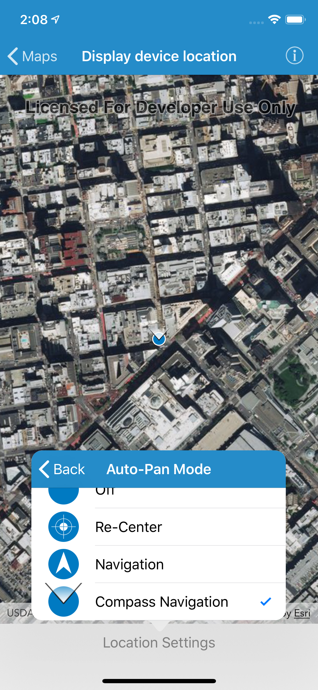

#Display device location

This sample demonstrates how you can enable location services and switch between different types of auto pan modes.

##How to use the sample

The sample comes with a button on the bottom, says `Stop` by default. When you tap on it, you are shown a list of options

* Stop: Stops the location display
* On: Starts location display with auto pan mode set to `Off`
* Re-center: : Starts location display with auto pan mode set to `Recenter`
* Navigation: : Starts location display with auto pan mode set to `Navigation`
* Compass: : Starts location display with auto pan mode set to `CompassNavigation`

##How it works

Each `AGSMapView` has its own instance of `AGSLocationDisplay`, stored as `locationDisplay`. The `dataSource` on `AGSLocationDisplay` is responsible for providing periodic location updates. The default dataSource uses the platform's location service (CLLocationManager). To start displaying location, you need to call `start(completion:)`. To stop displaying location, you need to call `stop()`. Use the `autoPanMode` property to change the how the map behaves when location updates are received.

**Note**: As of iOS 8, you are required to request for user's permission in order to enable location services. You must include either `NSLocationWhenInUseUsageDescription` or `NSLocationAlwaysUsageDescription` along with a brief description on how you would be using the location services in the info.plist of your project.

