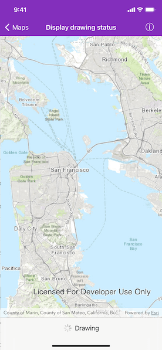

# Display draw status

Get the draw status of your map view or scene view to know when all layers in the map or scene have finished drawing.

## Use case

You may want to display a loading indicator while layers are loading, which could then be removed on `.completed`.

## How to use the sample

Pan and zoom around the map. Observe drawing status of the map in the toolbar.

## How it works

1. Create an instance of `AGSMapView`.
2. Using KVO, add an observer for `drawStatus` of type `AGSDrawStatus`. It could either be `inProgress` or `completed` based on if map is currently drawing or not. 
3. Every time it changes the `UIActivityIndicatorView` is shown or hidden.

## Relevant API

* AGSDrawStatus
* AGSMapView
* AGSMap

## Tags

draw, loading, map, render
