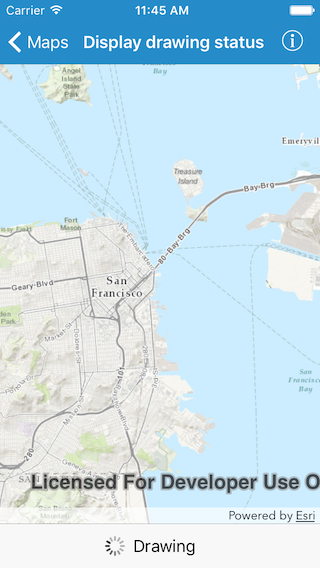

#Display drawing status

This sample display the current drawing status of the map in the toolbar.

##How it works

The AGSMapView:drawStatusChangedHandler block is called each time the AGSDrawStatus changes on the map. In this sample the block shows a UIActivityIndicatorView when the AGSDrawStatus is InProgress.

