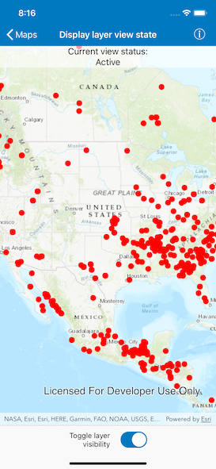

# Display layer view state

Determine if a layer is currently being viewed.

## Use case

The view state includes information on the loading state of layers and whether layers are visible at a given scale. For example, you might change how a layer is displayed in a layer list to communicate whether it is being viewed in the map: Show a loading spinner next to its name when the view state is `.loading`, gray out the name when `.notVisible` or `.outOfScale`, show the name normally when `.active`, or with an error icon when the state is `.error`.

## How to use the sample

Pan and zoom around in the map. Each layer's view status is displayed. Notice that some layers configured with a min and max scale change to `.outOfScale` at certain scales.

## How it works

1. Create an `AGSMap` with some operational layers.
2. Set the map on an `AGSMapView`.
3. Listen to `layerViewStateChangedHandler` of the map view, which get executed every time a layer's view status changes.
4. Get the `layer` of type `AGSLayer` and the current view `state` of type `AGSLayerViewState` defining the new state.

## Relevant API

* AGSLayer
* AGSLayerViewState
* AGSMap
* AGSMapView

## About the data

The map shows a tiled layer of world time zones, a map image layer of the census, and a feature layer of recreation services.

## Tags

layer, map, status, view
