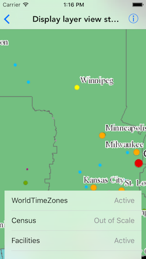

#Display layer view state

This sample demonstrates how to get view status for layers in a map. The layer's view status could be 

* Active
* Not Visible
* Out of Scale
* Loading
* Error

##How to use the sample

The sample displays the list of operational layers in the map. Each row in this list also has the view status corresponding to that layer. If you pan or zoom the map, the view status of some layers may change.

##How it works

`AGSMapView` has a block called `layerViewStateChangedHandler` that get executed every time a layer's view status changes. The block contains two attributes, namely, `layer` and `state`. The former being the `AGSLayer` whose state got changed and the latter is an `AGSLayerViewState` object defining the new state.

