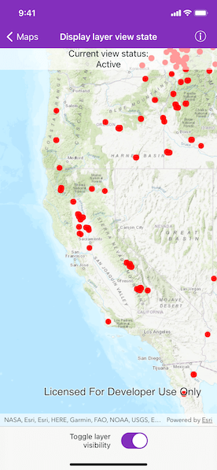

# Display layer view state

Determine whether a layer is currently visible.

## Use case

The view status includes information on the loading state of layers and whether layers are visible at a given scale. You might change how a layer is displayed in a layer list to communicate whether it is being viewed in the map. For example, you could show a loading spinner next to its name when the view status is `loading`, gray out the name when `notVisible` or `outOfScale`, show the name normally when `active`, or with an error icon when the state is `warning` or `error`.

## How to use the sample

When the feature layer is loaded, pan and zoom around the map. Note how the `AGSLayerViewState` flags change; for example, `outOfScale` becomes true when the map is scaled outside of the layer's min and max scale range. Tap the toggle to hide the layer and observe the view state change to `notVisible`.

Disconnect from the network and pan around the map to see the `warning` status of the different layers when they cannot fetch online data. Reconnect to the network to see the warning disappear.

## How it works

1. Create an `AGSMap` with some operational layers.
2. Set the map on an `AGSMapView`.
3. Assign a closure to `layerViewStateChangedHandler` of the map view, which get executed every time a layer's view status changes.
4. Get the `AGSLayer` and the current view `status` of type `AGSLayerViewState` defining the new state.

## Relevant API

* AGSLayer
* AGSLayerViewState
* AGSMap
* AGSMapView

## About the data

The [Satellite (MODIS) Thermal Hotspots and Fire Activity](https://runtime.maps.arcgis.com/home/item.html?id=b8f4033069f141729ffb298b7418b653) layer presents detectable thermal activity from MODIS satellites for the last 48 hours. [MODIS Global Fires](https://earthdata.nasa.gov/earth-observation-data/near-real-time/firms/active-fire-data) is a product of NASA’s [Earth Observing System Data and Information System (EOSDIS)](https://earthdata.nasa.gov/about), part of NASA's [Earth Science Data](https://science.nasa.gov/earth-science/earth-data/). EOSDIS integrates remote sensing and GIS technologies to deliver global MODIS hotspot/fire locations to natural resource managers and other stakeholders around the World.

## Additional information

The following are members of the `AGSLayerViewState` enum:

* `active`: The layer in the view is active.
* `notVisible`: The layer in the view is not visible.
* `outOfScale`: The layer in the view is out of scale. A status of `outOfScale` indicates that the view is zoomed outside of the scale range of the layer. If the view is zoomed too far in (e.g. to a street level), it is beyond the max scale defined for the layer. If the view has zoomed too far out (e.g. to global scale), it is beyond the min scale defined for the layer.
* `loading`: The layer in the view is loading. Once loading has completed, the layer will be available for display in the view. If there was a problem loading the layer, the status will be set to error.
* `error`: The layer in the view has an unrecoverable error. When the status is `error`, the layer cannot be rendered in the view. For example, it may have failed to load, be an unsupported layer type, or contain invalid data.
* `warning`: The layer in the view has a non-breaking problem with its display, such as incomplete information (e.g. by requesting more features than the max feature count of a service) or a network request failure.

## Tags

layer, load, map, status, view, visibility