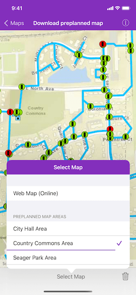

# Download preplanned map area

Take a map offline using a preplanned map area.

## Use case

Generating offline maps on demand for a specific area can be time consuming for users and a processing load on the server. If areas of interest are known ahead of time, a web map author can pre-create packages for these areas. This way, the generation only needs to happen once, making the workflow more efficient for users and servers.

An archeology team could define preplanned map areas for dig sites which can be taken offline for field use. To see the difference, compare this sample to the "Generate an offline map" sample.

## How to use the sample

Select a preplanned map area by tapping the 'Select Map' bar button item & selecting one of the showing available areas. Tapping a cell initiates a download, and shows download progress in the interim. Once downloaded, the preplanned map is displayed in the map view. If a preplanned map is reselected later, the locally cached data is loaded immediately.

## How it works

1. Open the online `AGSMap` from a `AGSPortalItem` and display it.
2. Create an `AGSOfflineMapTask` using the portal item.
3. Get the `AGSPreplannedMapArea`s from the task, and then load them.
4. To download a selected map area, create the default parameters with `AGSOfflineMapTask.defaultDownloadPreplannedOfflineMapParameters(with:completion:)` from the task using the selected preplanned map area.
5. Set the update mode of the preplanned map area.
6. Call `AGSOfflineMapTask.downloadPreplannedOfflineMapJob(with:downloadDirectory:)` to find the preplanned areas.
7. Start the job. Once it has completed, get the  `AGSDownloadPreplannedOfflineMapResult`.
8. Get the offline `AGSMap` from the result and display it in the `AGSMapView`.

## Relevant API

* AGSOfflineMapTask.downloadPreplannedOfflineMapJob(with:downloadDirectory:)
* AGSOfflineMapTask.defaultDownloadPreplannedOfflineMapParameters(with:completion:)
* AGSDownloadPreplannedOfflineMapResult
* AGSOfflineMapTask
* AGSPreplannedMapArea

## About the data

The [Naperville stormwater network map](https://arcgisruntime.maps.arcgis.com/home/item.html?id=acc027394bc84c2fb04d1ed317aac674) is based on ArcGIS Solutions for Stormwater and provides a realistic depiction of a theoretical stormwater network.

## Additional information

`AGSDownloadPreplannedOfflineMapParameters.updateMode` can be used to set the way the preplanned map area receives updates in several ways:

* `.noUpdates` - No updates will be performed. This mode is intended for when a static snapshot of the data is required, and it does not create a replica. This is the mode used for this sample.
* `.syncWithFeatureServices` - Changes, including local edits, will be synced directly with the underlying feature services. This is the default update mode.
* `.downloadScheduledUpdates` - Scheduled, read-only updates will be downloaded from the online map area and applied to the local mobile geodatabases.

See [Take a map offline - preplanned](https://developers.arcgis.com/ios/latest/swift/guide/take-map-offline-preplanned.htm) to learn about preplanned workflows, including how to define preplanned areas in ArcGIS Online. Alternatively, visit [Take a map offline - on demand](https://developers.arcgis.com/ios/latest/swift/guide/take-map-offline-on-demand.htm) or refer to the sample "Generate Offline Map" to learn about the on-demand workflow and see how the workflows differ.

## Tags

map area, offline, pre-planned, preplanned
