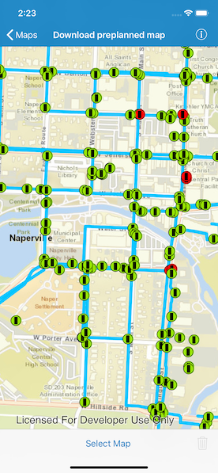

# Download preplanned map

Take a map offline using a preplanned map area.

## Use case

When a map is taken offline, a package containing basemap tiles, feature data, and other resources is created. In the preplanned workflow, the author of the web map has set up the offline packages ahead of time, which enables faster, more resource-efficient downloads compared to an on-demand workflow. Because the resources for the area are packaged once and can be downloaded many times by different users, this approach is more scalable for large organizations. To see the difference for yourself, compare this sample to the Generate an offline map sample.

## How to use the sample

Select a preplanned map area by tapping the 'Select Map' bar button item & selecting one of the showing available areas. Tapping a cell initiates a download, and shows download progress in the interim. Once downloaded, the preplanned map is displayed in the map view. If a preplanned map is reselected later, the locally cached data is loaded immediately.

## How it works

1. Open the map from a portal item and display it.
2. Create an `AGSOfflineMapTask` from the Portal item.
3. Call `AGSOfflineMapTask.downloadPreplannedOfflineMapJob(with:downloadDirectory:)` to find the preplanned areas, then load each one by calling `AGSPreplannedMapArea.load(completion:)`.
4. Display the areas in the UI.
5. When the user selects a map area, start the download.
    1. Create a `AGSDownloadPreplannedOfflineMapJob` using `downloadPreplannedOfflineMapJob(with:downloadDirectory:)`, passing in the parameters.
    2. Wait for the job to complete with `AGSDownloadPreplannedOfflineMapJob.start(statusHandler:completion:)`.
    3. Once the offline download completes successfully, show the offline map in the `AGSMapView`.

## Relevant API

- `AGSCancelable`
- `AGSDownloadPreplannedOfflineMapJob`
- `AGSLoadObjects`
- `AGSMap`
- `AGSMapView`
- `AGSMobileMapPackage`
- `AGSOfflineMapTask`
- `AGSPortal`
- `AGSPortalItem`
- `AGSPreplannedMapArea`

## About the data

The [Naperville stormwater network map](https://arcgisruntime.maps.arcgis.com/home/item.html?id=acc027394bc84c2fb04d1ed317aac674) is based on ArcGIS Solutions for Stormwater and provides a realistic depiction of a theoretical stormwater network.

## Additional information

See [Take a map offline - preplanned](https://developers.arcgis.com/net/latest/wpf/guide/take-map-offline-preplanned.htm) to learn about preplanned workflows, including how to define preplanned areas in ArcGIS Online.

## Tags

Offline, preplanned, pre-planned, map area