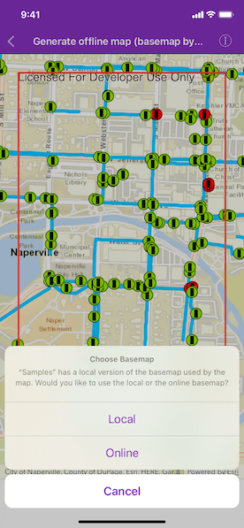

# Generate offline map with local basemap

Take a web map offline, but instead of downloading an online basemap, use one which is already on the device.

## Use case

There are a number of use-cases where you may wish to use a basemap which is already on the device, rather than downloading:

* You want to limit the total download size.
* You want to be able to share a single set of basemap files between many offline maps.
* You want to use a custom basemap (for example authored in ArcGIS Pro) which is not available online.
* You do not wish to sign into ArcGIS.com in order to download Esri basemaps.

The author of a web map can support the use of basemaps which are already on a device by configuring the web map to specify the name of a suitable basemap file. This could be a basemap which:

* Has been authored in ArcGIS Pro to make use of your organizations custom data.
* Is available as a portal item which can be downloaded once and re-used many times.

## How to use the sample

When the app starts, tap on "Generate Offline Map" button. You will be prompted to choose whether you wish to download the online basemap or use the local "naperville_imagery.tpk" basemap which is already on the device.

If you choose to download the online basemap, the offline map will be generated with the same (topographic) basemap as the online web map. To download the Esri basemap, you may be prompted to sign in to ArcGIS.com.

If you choose to use the basemap from the device, the offline map will be generated with the local imagery basemap. The download will be quicker since no tiles are exported or downloaded.

Since the application is not exporting online ArcGIS Online basemaps you will not need to log-in.

## How it works

1. Create an `AGSPortalItem` object using a web map's ID. 
2. Initialize an `AGSOfflineMapTask` object using the map created with the portal item.
3. Get the default parameters for the task by calling `AGSOfflineMapTask.defaultGenerateOfflineMapParameters(withAreaOfInterest:completion:)` with the selected extent. 
4. Check the `AGSGenerateOfflineMapParameters.referenceBasemapFilename` property. The author of an online web map can configure this setting to indicate the name of a suitable basemap. In this example, the application checks the app bundle for the suggested "naperville_imagery.tpk" file - and if found, asks the user whether they wish to use this instead of downloading.
5. Set the `AGSGenerateOfflineMapParameters.referenceBasemapDirectory` to the absolute path of the directory which contains the .tpk file, if the user chooses to use the basemap on the device.
6. Create an `AGSGenerateOfflineMapJob` by calling `AGSOfflineMapTask.generateOfflineMapJob(with:downloadDirectory:)` passing the parameters and the download location for the offline map.
7. Start the `AGSGenerateOfflineMapJob`. It will check whether `AGSGenerateOfflineMapParameters.referenceBasemapDirectory` has been set. If this property is set, no online basemap will be downloaded and instead, the mobile map will be created with a reference to the .tpk on the device.

## Relevant API

* AGSOfflineMapTask
* AGSGenerateOfflineMapParameters
* AGSGenerateOfflineMapJob
* AGSGenerateOfflineMapResult

## Offline data

This sample uses [naperville_imagery.tpk](https://arcgisruntime.maps.arcgis.com/home/item.html?id=628e8e3521cf45e9a28a12fe10c02c4d) TileCache. It is downloaded from ArcGIS Online automatically.

## Tags

basemap, download, local, offline, save, web map
