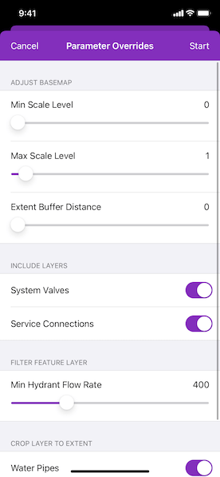

# Generate offline map (overrides)

Take a web map offline with additional options for each layer.

## Use case

When taking a web map offline, you may adjust the data (such as layers or tiles) that is downloaded by using custom parameter overrides. This can be used to reduce the extent of the map or the download size of the offline map. It can also be used to highlight specific data by removing irrelevant data. Additionally, this workflow allows you to take features offline that don't have a geometry - for example, features whose attributes have been populated in the office, but still need a site survey for their geometry.

## How to use the sample

Sign in with an ArcGIS Online account when prompted for credentials (taking web maps offline requires an account) and modify the overrides parameters:

* Use the sliders to adjust the the minimum and maximum scale levels and buffer radius to be taken offline for the streets basemap.
* Toggle the switches for the feature operational layers you want to include in the offline map.
* Use the min hydrant flow rate slider to only download features with a flow rate higher than this value.
* Turn on the "Water Pipes" switch if you want to crop the water pipe features to the extent of the map.

After you have set up the overrides to your liking, tap "Start" to start the download. A progress bar will display. Tap "Cancel" if you want to stop the download. When the download is complete, the view will display the offline map. Pan around to see that it is cropped to the download area's extent.

## How it works

1. Load a web map from an `AGSPortalItem`. Authenticate with the portal if required.
2. Create an `AGSOfflineMapTask` with the map.
3. Generate default task parameters using the extent area you want to download with `AGSOfflineMapTask.defaultGenerateOfflineMapParameters(withAreaOfInterest:completion:)` method.
4. Generate additional "override" parameters using the default parameters with `AGSOfflineMapTask.generateOfflineMapParameterOverrides(with:completion:)` method.
5. For the basemap:
    * Get the parameters `AGSOfflineMapParametersKey` for the basemap layer.
    * Get the `AGSExportTileCacheParameters` for the basemap layer from `AGSGenerateOfflineMapParameterOverrides exportTileCacheParameters[key]` with the key above.
    * Set the level IDs you want to download by setting the `levelIDs` property of `AGSExportTileCacheParameters`.
    * To buffer the extent, set a buffered geometry to the `areaOfInterest` property of `AGSExportTileCacheParameters`, where the buffered geometry can be calculated with the `AGSGeometryEngine`.
6. To remove operational layers from the download:
    * Create an `AGSOfflineMapParametersKey` with the operational layer.
    * Use the key to obtain the relevant `AGSGenerateGeodatabaseParameters` from the `generateGeodatabaseParameters` property of `AGSGenerateOfflineMapParameterOverrides`.
    * Loop through each `AGSGenerateLayerOption` and remove it from the geodatabase parameters' `layerOptions` if the layer option's ID matches the `serviceLayerID`.
7. To filter the features downloaded in an operational layer:
    * Get the layer options for the operational layer using the directions in step 6.
    * Loop through the layer options. If the option layerID matches the layer's ID, set the filter's `whereClause` property.
8. To not crop a layer's features to the extent of the offline map (default is true):
    * Set `useGeometry` property of `AGSGenerateLayerOption` to false.
9. Create an `AGSGenerateOfflineMapJob` with `AGSOfflineMapTask.generateOfflineMapJob(with:parameterOverrides:downloadDirectory:)`. Start the job with `AGSGenerateOfflineMapJob.start(statusHandler:completion:)`.
10. When the job is done, get a reference to the offline map with `AGSGenerateOfflineMapResult.offlineMap`.

## Relevant API

* AGSExportTileCacheParameters
* AGSGenerateGeodatabaseParameters
* AGSGenerateLayerOption
* AGSGenerateOfflineMapJob
* AGSGenerateOfflineMapParameterOverrides
* AGSGenerateOfflineMapParameters
* AGSGenerateOfflineMapResult
* AGSOfflineMapParametersKey
* AGSOfflineMapTask

## Additional information

For applications where you just need to take all layers offline, use the standard workflow (using only `AGSGenerateOfflineMapParameters`). For a simple example of how you take a map offline, please consult the "Generate offline map" sample.

## Tags

adjust, download, extent, filter, LOD, offline, override, parameters, reduce, scale range, setting
