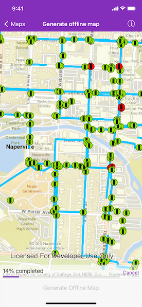

# Generate offline map

Take a web map offline.

## Use case

Taking a web map offline allows users continued productivity when their network connectivity is poor or nonexistent. For example, by taking a map offline, a field worker inspecting utility lines in remote areas could still access a feature's location and attribute information.

## How to use the sample

When the app starts, you will be prompted to sign in using a free ArcGIS Online account. Once the map loads, zoom to the extent you want to take offline. The red border shows the extent that will be downloaded. Tap the "Generate offline map" button to start the offline map job. The progress view will show the job's progress. When complete, the offline map will replace the online map in the map view.

## How it works

1. Create an `AGSMap` with a `AGSPortalItem` pointing to the web map.
2. Create `AGSGenerateOfflineMapParameters` with `AGSOfflineMapTask.defaultGenerateOfflineMapParameters(withAreaOfInterest:completion:)` specifying the download area geometry.
3. Create an `AGSOfflineMapTask` with the map.
4. Create the `AGSGenerateOfflineMapJob` with `AGSOfflineMapTask.generateOfflineMapJob(with:downloadDirectory:)` and start it with `AGSGenerateOfflineMapJob.start(statusHandler:completion:)`.
5. When the job is done, get the offline map within the completion closure.

## Relevant API

* AGSGenerateOfflineMapJob
* AGSGenerateOfflineMapParameters
* AGSGenerateOfflineMapResult
* AGSOfflineMapTask
* AGSPortal
* AGSPortalItem

## About the data

The map used in this sample shows the [Naperville water network](https://arcgisruntime.maps.arcgis.com/home/item.html?id=acc027394bc84c2fb04d1ed317aac674) within Naperville, IL, USA, with cartography designed for web and mobile devices with offline support.

## Additional information

The creation of the offline map can be fine-tuned using "Generate offline map (overrides)" sample, or by using "Generate offline map (basemap by reference)" sample to achieve more customized results.

## Tags

download, offline, save, web map
