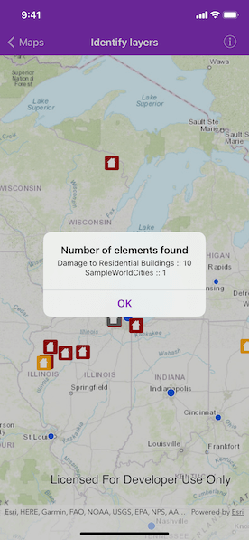

# Identify layers

Identify features in all layers in a map.

## Use case

Identify layers allows users to tap on a map, returning features at that location across multiple layers. Because some layer types have sublayers, the sample recursively counts results for sublayers within each layer.

## How to use the sample

Tap to identify features. An alert will show all layers with features at the tapped location, as well as a layer count.

## How it works

1. The tapped position is passed to `AGSGeoView.identifyLayers(atScreenPoint:tolerance:returnPopupsOnly:maximumResultsPerLayer:completion:)` method.
2. For each `AGSIdentifyLayerResult` in the results, features are counted. 
    * Note: there is one identify result per layer with matching features; if the feature count is 0, that means a sublayer contains the matching features.

## Relevant API

* AGSGeoView.identifyLayers(atScreenPoint:tolerance:returnPopupsOnly:maximumResultsPerLayer:completion:)
* AGSIdentifyLayerResult
* AGSIdentifyLayerResult.sublayerResults
* AGSLayerContent.name

## Additional information

`AGSGeoView` supports two methods of identify: `identifyLayer`, which identifies features within a specific layer, and `identifyLayers`, which identifies features for all layers in the current view.

## Tags

identify, recursion, recursive, sublayers
