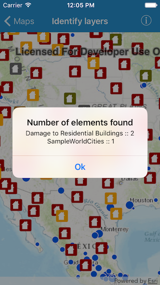

#Identify layers

This sample demonstrates how to identify features on a map. These features could be from different layers present in the map.

##How to use the sample

Tap on map to get features at that location. The features are returned from different layers in the map.

##How it works

`AGSMapView` has a `identifyLayers(atScreenPoint:tolerance:returnPopupsOnly:maximumResultsPerLayer:completion:)` method that is being used in the sample. This method takes the tap location, a tolerance and maximum results per layer and in the completion block provides an array of `AGSIdentifyLayerResult` objects. For a feature layer, the result object might have the `geoElements` property populated, if any elements are present at that location. For a map image layer, the result object might have sublayer result objects populated with geoElements or they might in turn have sublayer result objects.

