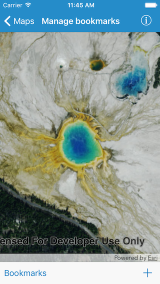
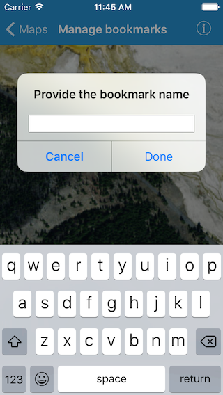

#Manage bookmarks

This samples demonstrates how to access and add bookmarks to a map

##How to use the sample

The map in the sample comes pre-populated with a set of bookmarks. You can tap on the `Bookmarks` button in the bottom toolbar to get the list. Then select either of them to update the map view. To create a new bookmark, pan and/or zoom to a new location and tap on the `+` button in the toolbar. You will be prompted to provide a name for the new bookmark. When you tap `Done` the new bookmark should also show up in the list.

##How it works

The `AGSMap` has a property called `bookmarks` which is a list of `AGSBookmark`. Each of these bookmarks have a `name` and `viewpoint`. We use the `bookmarks` list as the data source for the UITableView which popups when you tap on the `Bookmarks` button. For each cell inside that table we use the `bookmark.name` property as the title. And on selection we use the `bookmark.viewpoint` property to update the visible area.

For the creation workflow, we create a new `AGSBookmark` object using `mapView.currentViewpoint(with:)` as the `bookmark.viewpoint` and the name you provide as the `bookmark.name`. And then finally, we add the new bookmark to the list of bookmarks using `map.bookmarks.add(bookmark)`

