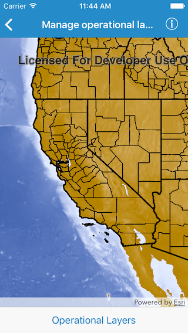
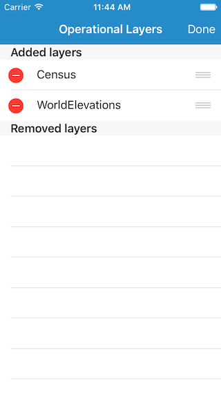

#Manage operational layers

This sample demonstrates how to add, remove or reorder operational layers in a map

##How to use the sample

The map in the sample app comes with two map image layers already added. If you tap on the `Operational Layers` button in the bottom toolbar, you will be shown a list of the layers. The list is divided into two different sections. The first section has the layers that are currently part of the map and the second sections has the removed layers. In first section, you can tap on the `-` delete button to remove a layer or you can tap hold the reordering control and drag to reorder a layer. In the second section, you can simplify tap on a removed layer to put it back. The layer gets added onto the top.

##How it works

`AGSMap` has a property called `operationalLayers` which is a list of `AGSLayer`. To add a layer the app uses the `add()` method on the list (`AGSList`). To remove a layer it uses `removeObject(at:)` method and for re-ordering it uses a combination of those methods.

