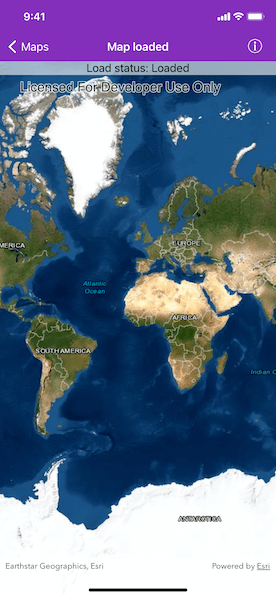

# Map load status

Determine the map's load status which can be `notLoaded`, `failedToLoad`, `loading`, or `loaded`.

## Use case

Knowing the map's load state may be required before subsequent actions can be executed.

## How to use the sample

Open the sample to load the map. The load status will be displayed on screen.

## How it works

The sample uses Key-Value Observing on the `AGSMap`’s `loadStatus` property to determine when the status has changed. The `AGSLoadStatus` is `loaded` when any of the following criteria are met:

* The map has a valid spatial reference.
* The map has an an initial viewpoint.
* One of the map's predefined layers has been created.

## Relevant API

* AGSLoadStatus
* AGSMap
* AGSMapView

## Tags

loadable pattern, loadStatus, map
