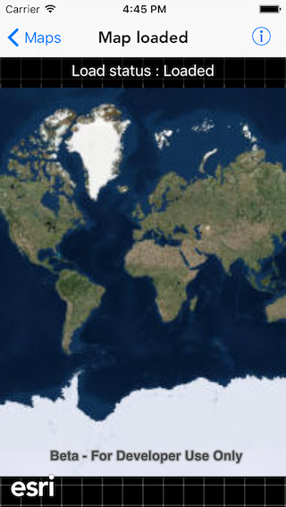

#Map loaded

This sample shows how to tell what the map's load status is. This is obtained from the enum value from a LoadStatus class. The LoadStatus is considered loaded when any of the following are true:

- The map has a valid spatial reference
- The map has an an initial viewpoint
- One of the map's predefined layers has been created.

##How it works

The sample sets a KVO on the `loadStatus` property on `AGSMap`. And then updates the banner label every time the status changes.

