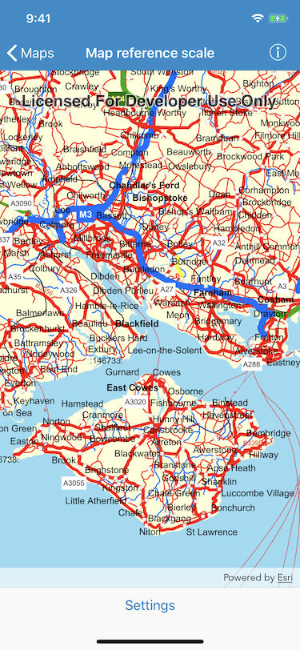
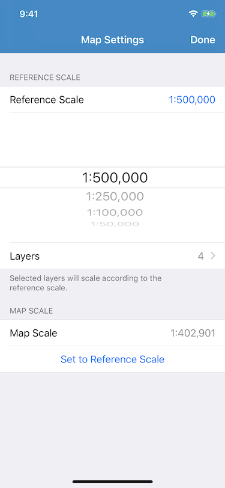

# Map reference scale

Set the map's reference scale and which feature layers should honor the reference scale.

 

## Use case

Setting a reference scale on a map fixes the size of symbols and text to the desired height and width at that scale. As you zoom in and out, symbols and text will increase or decrease in size accordingly. When no reference scale is set, symbol and text sizes remain the same size relative to the map view.

Map annotations are typically only relevant at certain scales. For instance, annotations to a map showing a construction site are only relevant at that construction site's scale. So, when the map is zoomed out that information shouldn't scale with the map view, but should instead remain scaled with the map. 

## How to use the sample

- Open the settings view, tap the Reference Scale row, and use the picker to set the map's reference scale (1:500,000 1:250,000 1:100,000 1:50,000).
- Tap the Set to Reference Scale button to set the map scale to the reference scale.
- Tap the Layers row to show a list of the map's feature layers. Tap a row to toggle whether that layer should honor the reference scale.

## How it works

1. Get and set the `referenceScale` property on the `AGSMap` object.
1. Get and set the `scaleSymbols` property on individual `AGSFeatureLayer` objects.

## Relevant API

- `AGSMap`
- `AGSFeatureLayer`

## Additional Information

The map reference scale should normally be set by the map's author and not exposed to the end user like it is in this sample. 

## Tags

Maps & Scenes