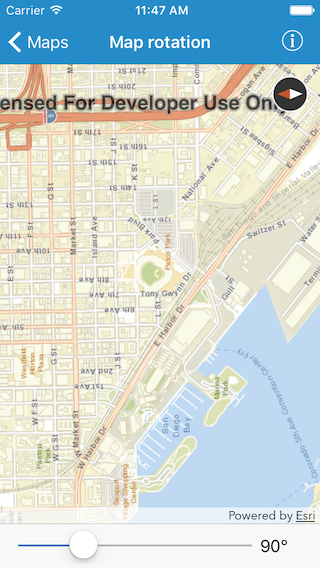

#Map rotation

This sample demonstrates how to rotate a map on your iOS device.

##How to use the sample

There are a bunch of ways you can change the rotation of the map in this sample. You can use the slider or pinch and rotate or tap on the compass (to reset).

##How it works

To set rotation of a map, `AGSMapView` provides a few methods. You can use the `setViewpointRotation:completion:` method and give it an angle in degrees. Or you can create a rotated `AGSViewpoint` using `initWithCenter:scale:rotation:` or `initWithTargetExtent:rotation:` and set it using the following methods on `AGSMapView` - `setViewpoint:`, `setViewpoint:completion:`, `setViewpoint:duration:completion:`, `setViewpoint:duration:curve:completion:`.

To listen for rotation angle changes, `AGSMapView` provides a block called `visibleAreaChangedHandler` which fires each time the visible area of the map view changes. The change could be because of a pan or a zoom or a rotation or a combination of these. You can also check the current rotation angle of a map by using the `rotation` property on `AGSMapView`

