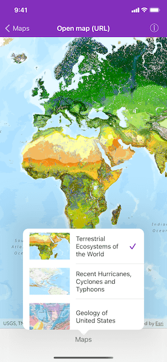

# Open map (URL)

Display a web map.

## Use case

For displaying web maps stored on ArcGIS Online.

## How to use the sample

Tap the button to see a list of other web maps. Upon selection, the web map displays in the map view.

## How it works

1. Create an `AGSPortal` object.
2. Create an `AGSPortalItem` using the portal and the web map ID.
3. Create an `AGSMap` using the portal item.
4. Set the map to the `AGSMapView`.

## Relevant API

* AGSMap
* AGSMapView
* AGSPortal
* AGSPortalItem

## About the data

The web maps accessed by this sample show [Geology for United States](https://arcgis.com/home/item.html?id=92ad152b9da94dee89b9e387dfe21acd), [Terrestrial Ecosystems of the World](https://arcgis.com/home/item.html?id=5be0bc3ee36c4e058f7b3cebc21c74e6) and [Recent Hurricanes, Cyclones and Typhoons](https://arcgis.com/home/item.html?id=064f2e898b094a17b84e4a4cd5e5f549).

## Tags

portal item, web map
