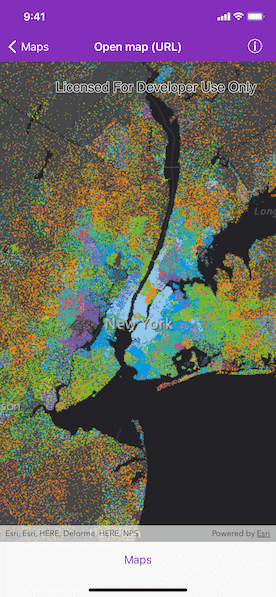
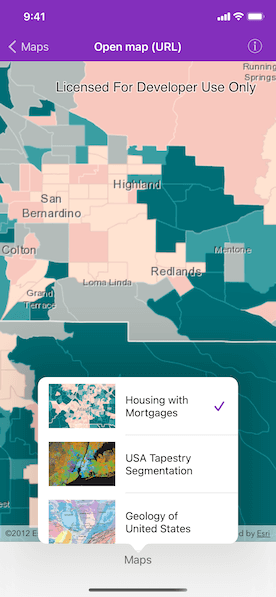

# Open map URL

Display a web map.

## Use case

For displaying web maps stored on ArcGIS Online (e.g. soil survey results, as demonstrated in this sample).

## How to use the sample

Tap the button to see a list of other web maps. Upon selection, the web map displays in the map view.

## How it works

1. Create an `AGSPortal` object.
2. Create an `AGSPortalItem` using the portal and the web map ID.
3. Create an `AGSMap` using the portal item.
4. Set the map to the `AGSMapView`.

## Relevant API

* AGSMap
* AGSMapView
* AGSPortal
* AGSPortalItem

## Additional information

Mobile map packages can also include address locators and geometric networks. For an example of this, see the "Mobile map (search and route)" sample.

## Tags

portal item, web map
