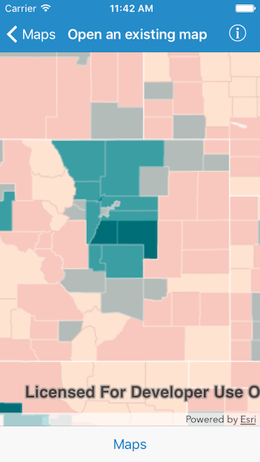
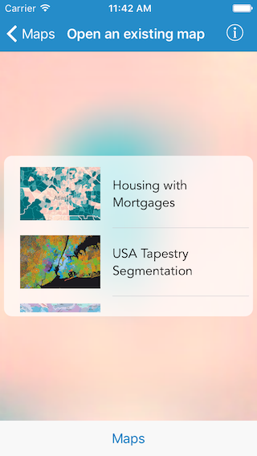

# Open map (URL)

This sample demonstrates how to open a web map from a URL on your iOS device.

## How to use the sample

The sample opens with a web map displayed by default. You can tap on the `Maps` button in the bottom toolbar to see a list of other web maps. On selection the web map opens up in the map view.

## How it works

The sample already has a set of URLs of three different web maps. Every time a selection is made, it creates a new instance of `AGSMap` using the `init(url:)` initializer and assigns it to the map view.

