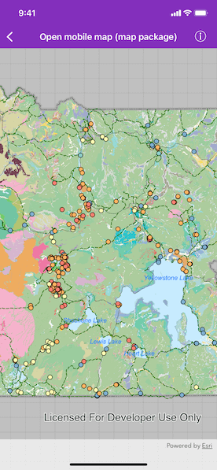

# Open mobile map package

Display a map from a mobile map package.

## Use case

A .mmpk file is an archive containing the data (specifically, basemaps and features) used to display an offline map.

## How to use the sample

When the sample loads, it will automatically display the map in the mobile map package. Pan and zoom to observe the data from the mobile map package.

## How it works

1. Create an `AGSMobileMapPackage` specifying the path to the .mmpk file.
2. Load the mobile map package with the `AGSMobileMapPackage.load(completion:)` method.
3. After it successfully loads, get the map from the .mmpk and add it to the map view.

## Relevant API

* AGSMapView
* AGSMobileMapPackage

## About the data

This sample shows points of interest within a [Yellowstone Mobile Map Package](https://arcgisruntime.maps.arcgis.com/home/item.html?id=e1f3a7254cb845b09450f54937c16061) hosted on ArcGIS Online.

## Tags

mmpk, mobile map package, offline
