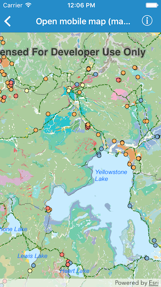

#Open mobile map (map package)

This sample demonstrates how to open a mobile map from a map package

##How it works

The sample uses `init(name:)` initializer on `AGSMobileMapPackage` to instantiate a map package object using the name of the package already added to the bundle. It then loads the map package using `load(completion:)` method. And on successful completion assigns the first mobile map from package to the map view.

