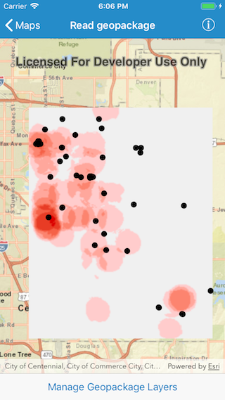
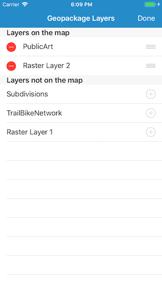

# Read a geopackage

This sample demonstrates how to add, remove or reorder operational layers in a map using a geopackage.

## How to use the sample

The map in the sample app starts out empty, with just a basemap. If you tap on the `Manage Geopackage Layers` button in the bottom toolbar, you will be shown a list of layers provided by the geopackage. The list is divided into two sections. The first section has the layers that are currently part of the map and the second sections has layers that are not currently included in the map. In first section, you can tap on the `-` button to remove a layer or you can tap and hold the reordering control and drag to reorder a layer. In the second section, you can simply tap on a layer to add it to the map. The layer gets added onto the top. Tap outside the layers popover to return to the map.

## How it works

`AGSMap` has a property called `operationalLayers` which is a list of `AGSLayer`. To add a layer the app uses the `add()` method on the list (`AGSList`). To remove a layer it uses the `remove()` method. To re-order layers, the app uses the `remove()` method and the `insert(at:)` method to re-add the layer at the appropriate index.
