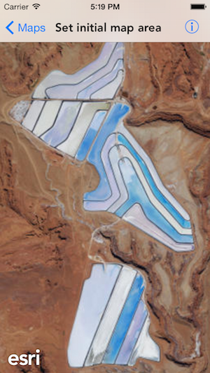

#Set initial map area

This sample displays a map at a specific viewpoint.

##How it works

In this sample a viewpoint `AGSViewpoint` is constructed from an envelope `AGSEnvelope` defined by minimum (x,y) and maximum (x,y) values. The map's initialViewpoint is set to this viewpoint before the map is loaded by the `AGSMapview`. Upon loading the map zooms to this initial area.

