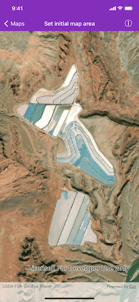

# Set initial map area

Display the map at an initial viewpoint representing a bounding geometry.

## Use case

Setting the initial viewpoint is useful when a user wishes to first load the map at a particular area of interest.

## How to use the sample

As the sample opens, the initial view point is set and the map view opens at the given location.

## How it works

1. Instantiate an `AGSMap` object.
2. Instantiate an `AGSViewpoint` object using an `AGSEnvelope` object.
3. Set the starting location to the `initialViewpoint` property of the map.
4. Set the map to an `AGSMapView` object.
 
## Relevant API

* AGSMap
* AGSEnvelope
* AGSMapView
* AGSViewpoint

## Tags

initial viewpoint, extent, zoom, envelope
