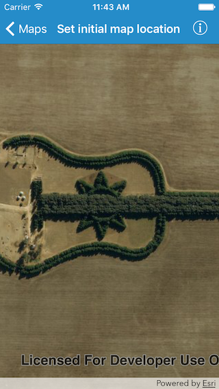

#Set initial map location

This sample creates a map with a standard ESRI Imagery with Labels basemap that is centered on a latitude and longitude location and zoomed into a specific level of detail.

##How it works

The sample uses the all-encompassing map constructor to initialize with the imagery with labels basemap at an initial location. The basemap is one of the standard ArcGIS Online basemaps and is defined using `AGSBasemapType` of `.imageryWithLabels`.

